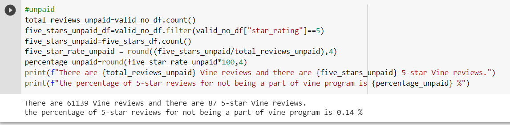

# Amazon_Vine_Analysis
## Overview
This project is extracting the reviews of wireless products from Amazon and analyze the 5-star reviews being or not being part of the vine program. We have perfromed ETL process to extract the dataset, transform the data connected to an AWS RDS instance, then loaded the data to pgAdmin. Furuthermore, we have determined if there is any bias toward the favorable reviews from Vine members or non-Vine members.
## Results

As we can see from above two pictures, we have all the data we need for analysis:
* For the Vine members, there are totally 585 reviews and 213 of them are 5-star. The percentage of 5 star rate is 36.41%.
* For the non Vine members, there are totaly 61139 reviews and only 87 of them are 5-star. The percentage of 5 star rate is 0.14%.

## Summary
From the above data, the percentage of 5-star rate for non Vine members are only 0.14% which is not really trustable.In comparison with the 5-star rate from Vine member, it is about 36% which is much more significant. It seems like there might be more positive bias for Vine members to give a 5-star rate for the product. I believe the data from only one category is not strong enough to support my point of view, I would like to calculate the 5-star percentage rate for both members and non-members of Vine in at least 10 categories to verify if there is any positive bias for reviews in the Vine program.
